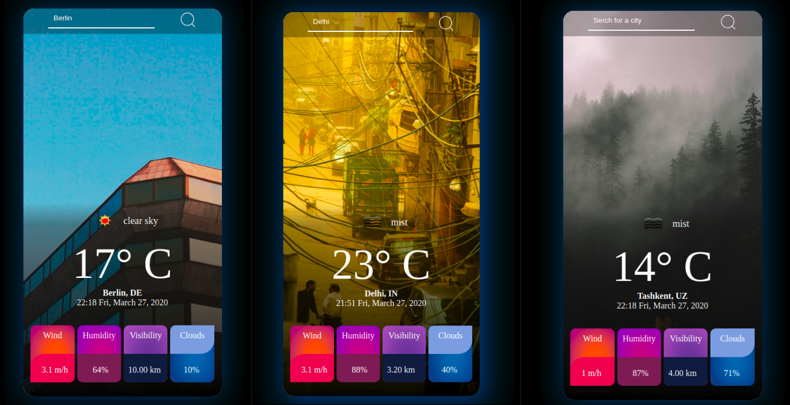
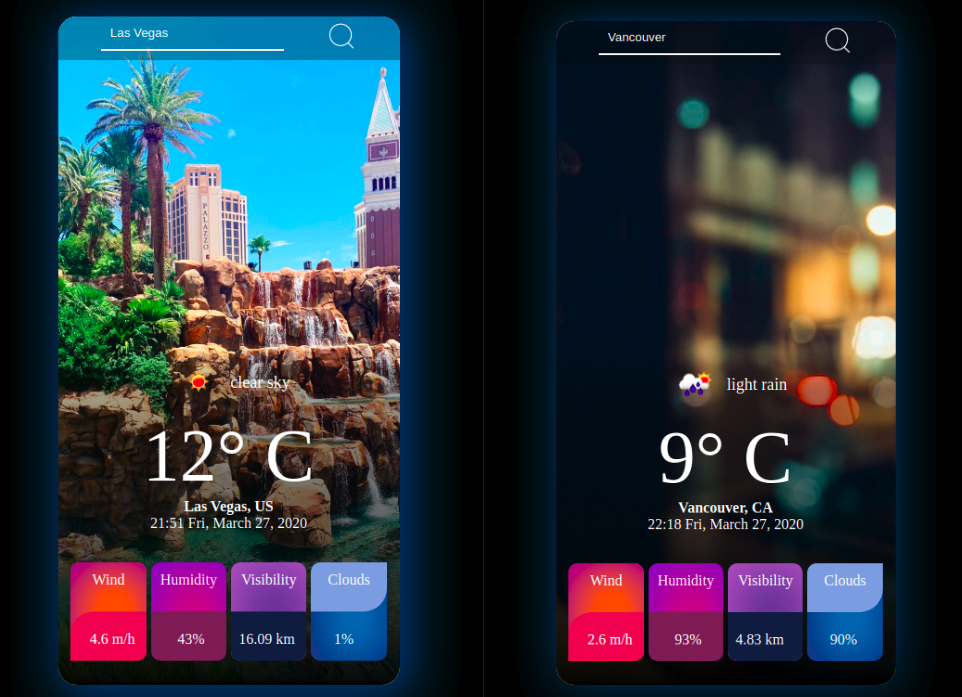

# Weather App

> Weather app built by using vanilla JS, fetches data from Open Weather, ipapi, and Unsplash APIs. It shows the weather information of user's city when the page is loaded, user can also search for weather info of other cities.



## Built With
* Vanilla JavaScript
* Webpack, Eslint, HTML, CSS
## Live Demo
[Project Demo](https://#)

## Run Locally
To get a local copy up and running follow these simple example steps.

> Clone project to your local machine
```bash
git clone https://github.com/Abdusaid10/weatherApp/
cd weatherApp
```
> Install dependencies
```bash
npm install
```
> Build project
```bash
npm build
```
> Run Locally
```bash
npm start
```
## Author

-[Abdusaid Abdurasulov](https://github.com/Abdusaid10)

## Contributing
Contributions, issues and feature requests are welcome!

Feel free to check the issues page.
## Links
[Open Weather API](http://openweathermap.org//)

[IP API](https://ipapi.co/)

[Unsplash](https://unsplash.com/)

[Refenrence tutorial](https://www.youtube.com/watch?v=n4dtwWgRueI)

[Webpack configuration](https://webpack.js.org/guides/getting-started/)
## License
This project is [MIT](https://github.com/Abdusaid10/weatherApp/blob/master/LICENSE) licensed.